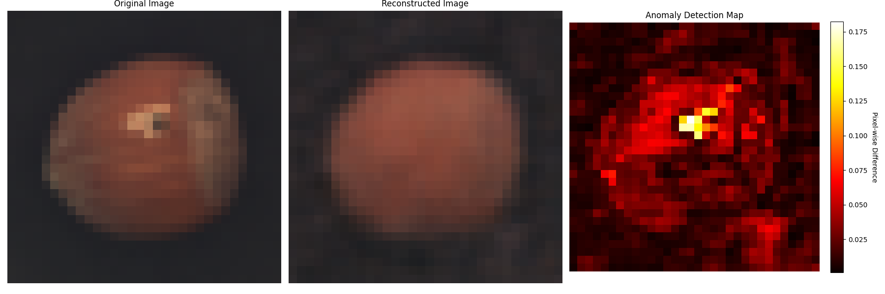
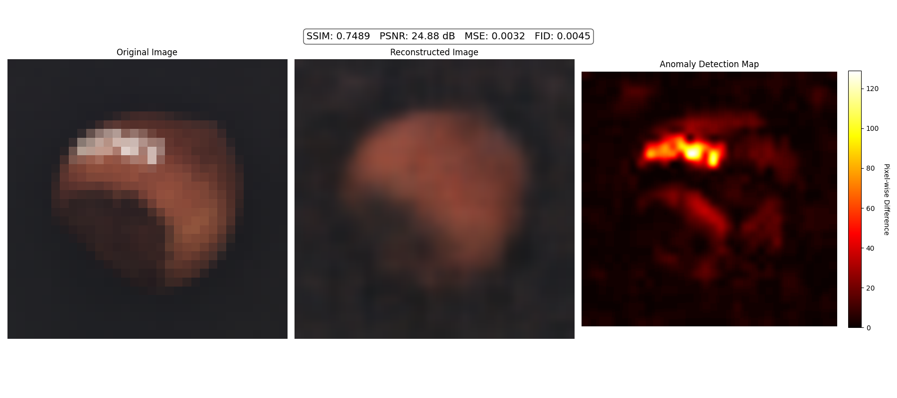
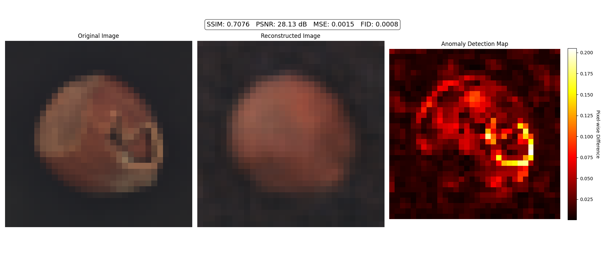

# ESVAE-AD on MVTec AD Dataset

This repository uses Efficient Spiking Variational Autoencoder for Anomaly Detection of the MVTec AD Dataset .

ESVAE: An Efficient Spiking Variational Autoencoder with Reparameterizable Poisson Spiking Sampling 
arxiv: https://arxiv.org/abs/2310.14839


# Get started

1. install dependencies

```
pip install -r requirements.txt
```

2. initialize the fid stats

```
python init_fid_stats.py
```

# Demo 
The following command calculates the Inception score & FID of ESVAE trained on CelebA. After that, it outputs `demo_input_esvae.png`, `demo_recons_esvae.png`, and `demo_sample_esvae.png`.
```
python demo_esvae.py
```

# Training Efficient Spiking Variational Autoencoder
```
python main_esvae -name exp_name -config NetworkConfigs/esvae_configs/dataset_name.yaml

```

Training settings are defined in `NetworkConfigs/esvae/*.yaml`.

args:
- name: [required] experiment name
- config: [required] config file path
- checkpoint: checkpoint path (if use pretrained model) 
- device: device id of gpu, default 0

You can watch the logs with below command and access http://localhost:8009/ 

```
tensorboard --logdir checkpoint --bind_all --port 8009
```

# Train ESVAE on the MVTEC AD Dataset for Anomaly Detection
For the MVTEC AD Dataset use the CIFAR10 NetworkConfigs, which have been rerouted to load the MVTEC AD Dataset.
The ESVAE-model should be trained on only good/anomalyfree Data for the comparison of Input and Output in the inference.
Adjust the dataset path in dataset/load_dataset_snn.py if needed.

```
python main_esvae.py -name exp_name -config NetworkConfigs/esvae_configs/CIFAR10.yaml   

```

When training with Slurm (e.g. on the BwHPC-Cluster) use 

```
sbatch run_ESVAE.sh

```

# Inference with Anomaly Detection

To use the trained model for inference adjust the path to the input image and to the model 

```
python anomaly_comparison.py

```


# Training ANN VAE
As a comparison method, we prepared vanilla VAEs of the same network architecture built with ANN, and trained on the same settings.

```
python main_ann_vae exp_name -dataset dataset_name
```

args: 
- name: [required] experiment name
- dataset:[required] dataset name [mnist, fashion, celeba, cifar10]
- batch_size: default 250
- latent_dim: default 128
- checkpoint: checkpoint path (if use pretrained model) 
- device: device id of gpu, default 0

# Evaluation



